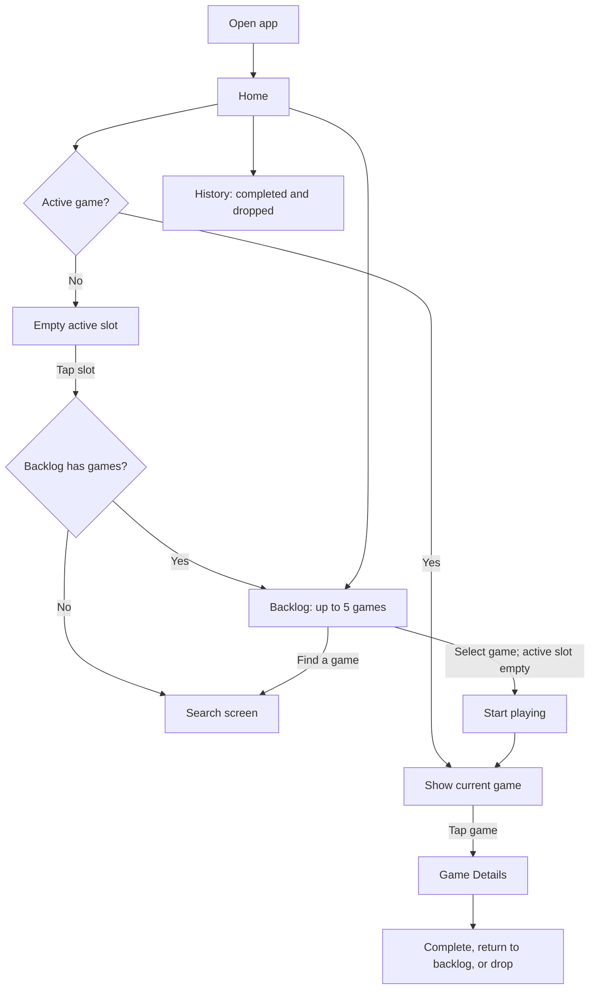
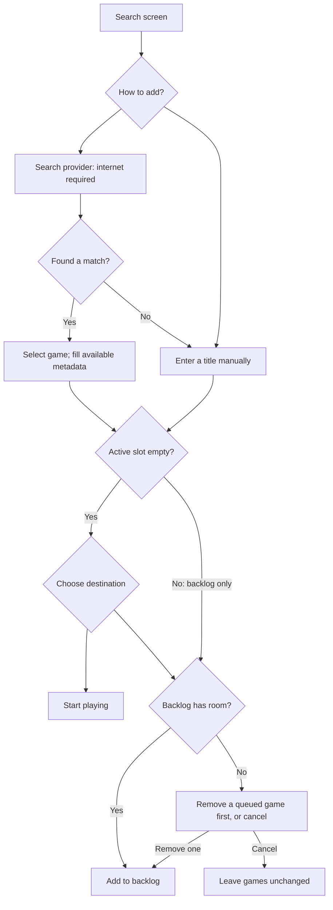
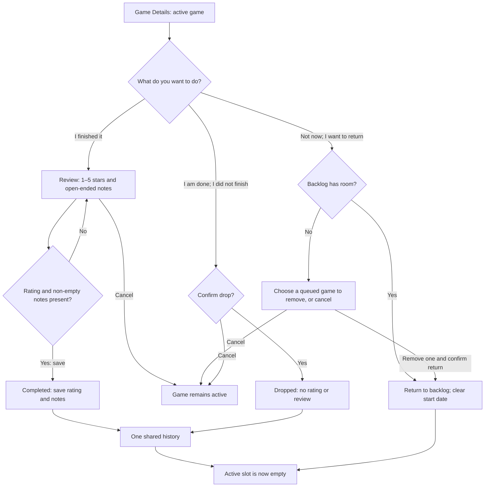

# Analogue — App Flow

An adaptive Android app for intentional play: choose one game, experience it,
then give it attention through a rating and your own thoughts.

This document captures the flow agreed during brainstorming. It is not an
implementation plan. The [PRD](PRD.md) and [games-first design](design/games-first.md)
have not yet been reconciled with these latest decisions, including one shared
history, home navigation, and keyboard-only dictation.

## Screens

| Screen | Responsibility |
| --- | --- |
| Home | Show the active game or an empty slot, with Backlog and History entry points. |
| Game Details | Show the active game's details and offer Complete, Return to backlog, and Drop. |
| Search | Find a game, fill available metadata, or enter a game manually; start or queue it as allowed. |
| Backlog | Show up to five queued games; start one when the active slot is empty, remove one, or open Search. |
| Review | Collect the required rating and open-ended notes when completing a game. |
| History | Show completed and dropped games together and provide access to saved reviews. |

Drop confirmation and full-backlog removal selection are dialogs or sheets, not
additional main screens. The presentation for reading a saved review and the
initial sign-in flow remain undecided.

## 1. Home and navigation

The active game is the focus. Backlog and History are small, accessible entry
points rather than competing content on the home screen. Complete, Return to
backlog, and Drop live on Game Details, not Home.

Tapping an occupied slot opens Game Details. Tapping an empty slot opens Backlog
if it contains games; otherwise it opens Search directly. Backlog has a
**Find a game** action that opens the separate Search screen.

History is one list with clear **Completed** and **Dropped** labels. Completed
entries contain ratings and reviews; dropped entries do not. Filters are deferred.

## 2. Find and start a game

Search is a separate screen reached from Backlog or by tapping an empty home slot
when the backlog is empty. Selecting a search result automatically fills available cover art, genre, and
store links. Manual entry requires only a title; it also works offline.

A game already in the backlog can be started only when the active slot is empty.
Starting it moves it out of the backlog and into the active slot. Finding another
game never replaces the active game automatically.

## 3. End the current commitment

- **Complete:** requires a rating and written thoughts. One open-ended field, no
  guided question or minimum word count. Notes happen here, not during play.
- **Return to backlog:** means “not now.” No review, penalty, or history entry.
  A full backlog requires an explicit removal before the return; canceling leaves
  the active game and queue unchanged. Never exceed five or silently evict a game.
- **Drop:** means “I did not finish, and I do not intend to return.” Confirmation
  frees the active slot and records the game in history without a review.

## Offline and input behavior

After initial sign-in, starting, completing, reviewing, returning, dropping, and
manual game entry work offline. Search needs internet. Saved changes sync when
connected; cross-device offline conflict handling is explicitly deferred, with
no conflict policy selected.

Reviews use a normal text field. Users can use their keyboard's dictation when
available; there is no dedicated recording or app-managed transcription feature
in the initial release.

The same Android app adapts to phone, large-screen, and resizable desktop-style
windows. This does not introduce separate desktop applications.
